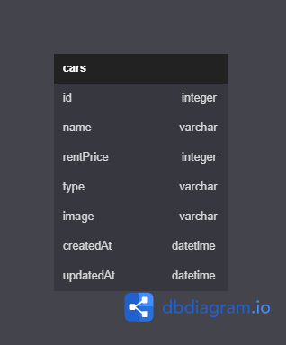

# HTTP REQUEST METHOD

1. Menampilkan halaman utama
   <http://localhost:8081/>

2. Menambahkan data
   <http://localhost:8081/create>

3. Edit Data
   <http://localhost:8081/edit/:id>

4. Delete Data
   <http://localhost:8081/delete/:id>

5. Menampilkan Edit Data
   <http://localhost:8081/edit/:id>

